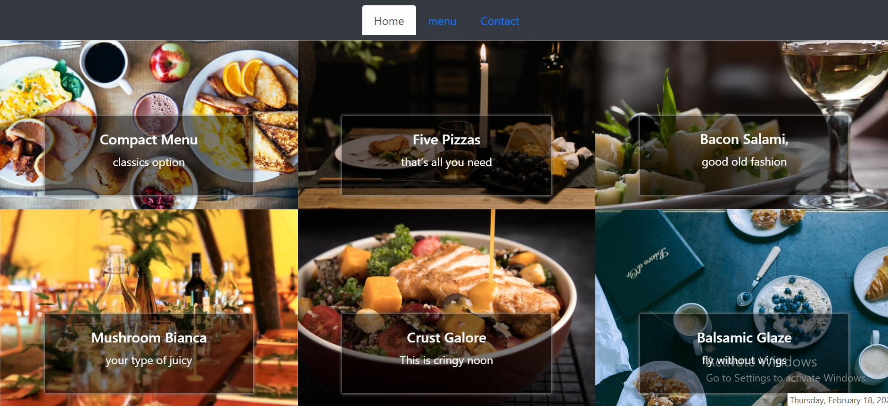

# Social on Main Restaurant

- Javascript Restaurant website.
- The site contains the landing, menu list tab as well as the contact page..



## Built With

- Javascript
- HTML
- CSS
- Bootstrap

## Getting Started

To get a local copy up and running follow these simple example steps.

### Setup

- Open the console
- Download or git clone https://github.com/karmaester/Books-Books
- cd Books-Books

Install Node and npm:

```
  sudo apt install nodejs
  sudo apt install npm
  npm init -y
  npm install webpack webpack-cli --save-dev
```

- Open index.html file in browser

### Github Actions

To make sure the linters' checks using Github Actions work properly, you should follow the next steps:

1. On your recent repo, enable the GitHub Actions in the Actions tab.
2. Create the `feature/branch` and push.
3. Open a PR from the `feature/branch` when your work is done.

## Authors

👤 **Will Nyamunokora**

- Github: [@bigwizzo](https://github.com/bigwizzo)
- Twitter: [@willnyamunokora](https://twitter.com/willnyamunokora)
- Linkedin: [@willnyamunokora](https://linkedin.com/in/willnyamunokora)

## 🤝 Contributing

Contributions, issues and feature requests are welcome!

Feel free to check the [issues page](https://github.com/BigWizzo/restaurant/issues).

## Show your support

Give a ⭐️ if you like this project!

## Acknowledgments

- Microverse
- Stand up Team
- TSEs
- Traversy Media

## 📝 License

This project is [MIT](https://opensource.org/licenses/MIT) licensed.
